# Stock Buy Planner — UML

Render these diagrams in GitHub, VS Code/Cursor (Mermaid preview), or any Mermaid viewer.

---

## 1. Component diagram

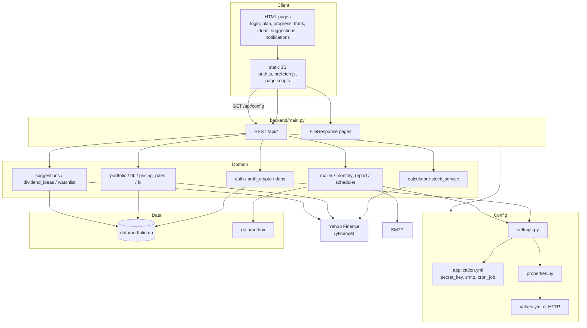

---

## 2. Deployment / runtime

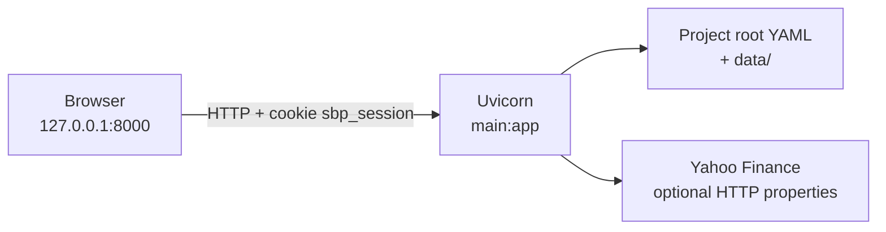

---

## 3. Package / class view (backend)

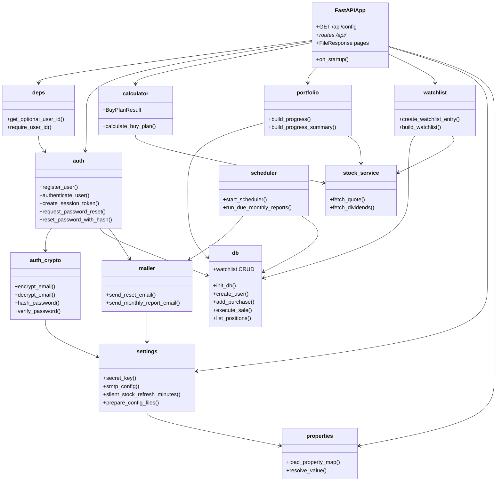

---

## 4. Entity-relationship (SQLite)

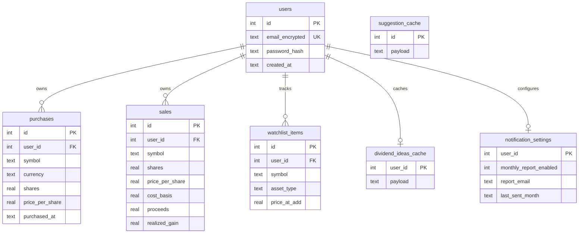

Sells apply FIFO: `execute_sale` reduces or deletes matching `purchases` lots.

---

## 5. Sequence — login / session

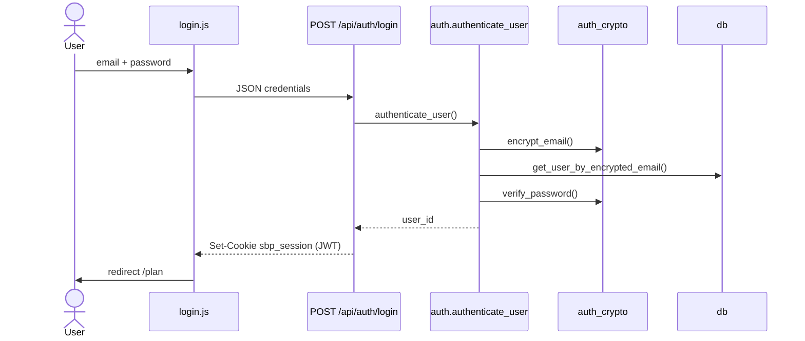

Register is the same cookie path after `register_user` → `create_user`.

---

## 6. Sequence — password reset

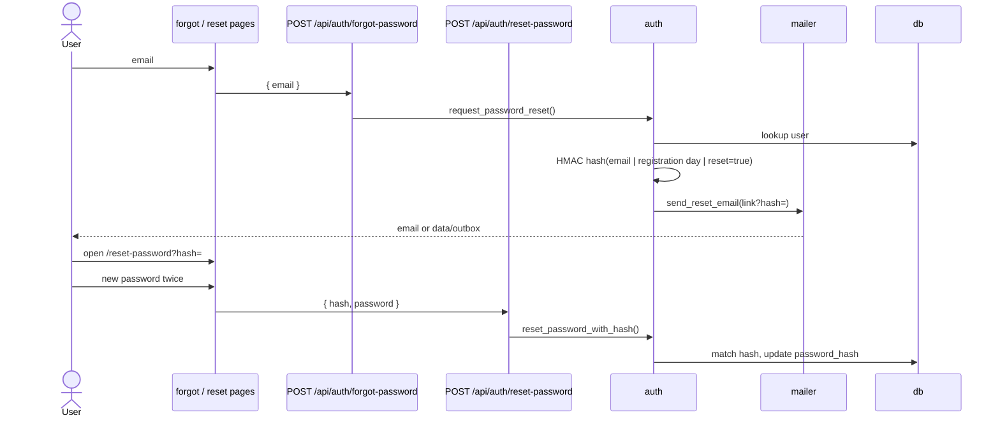

---

## 7. Sequence — buy plan

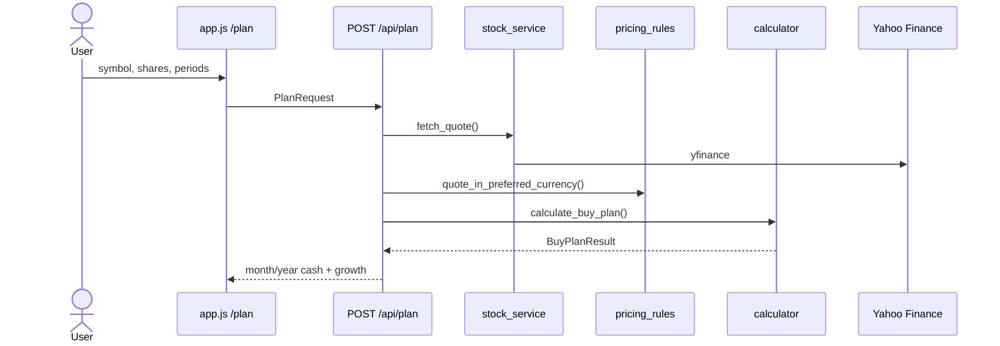

No login required.

---

## 8. Sequence — buy / sell (progress)

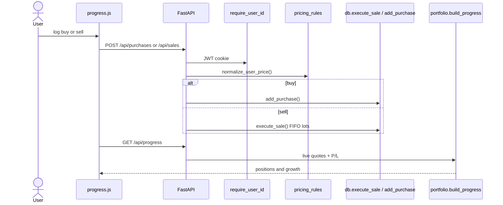

---

## 9. Sequence — config at runtime

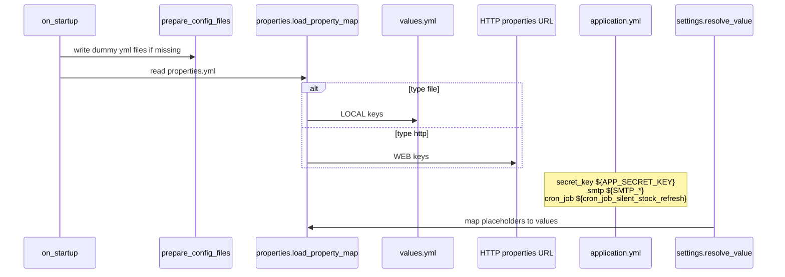

---

## 10. Frontend pages

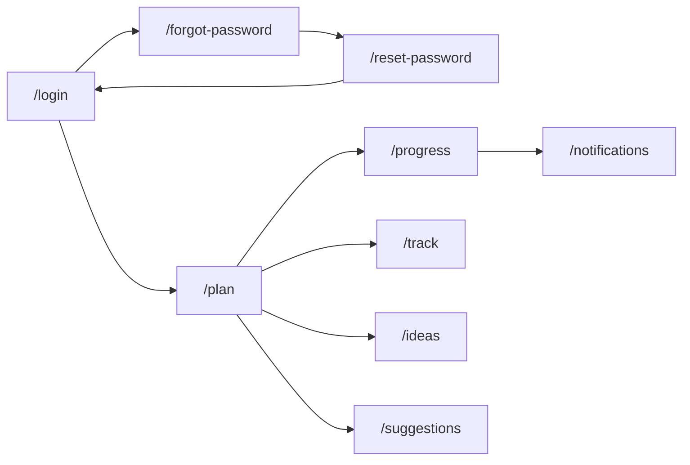

Cookie-gated: `/progress`, `/track`, `/notifications`.

`prefetch.js` on each page calls `GET /api/config` and uses the resolved minutes (JSON field `cron_job_silent_stock_refresh`). In YAML this is `cron_job: ${cron_job_silent_stock_refresh}`, loaded from `values.yml` or HTTP, default **15** if the key is missing.

---

## 11. Sequence — silent stock refresh (`cron_job`)

Interval comes from `application.yml` → property key `cron_job_silent_stock_refresh` (default 15 minutes). It is **not** the monthly-report thread in `scheduler.py`.

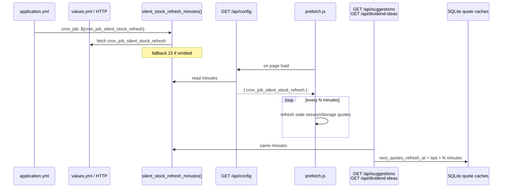
